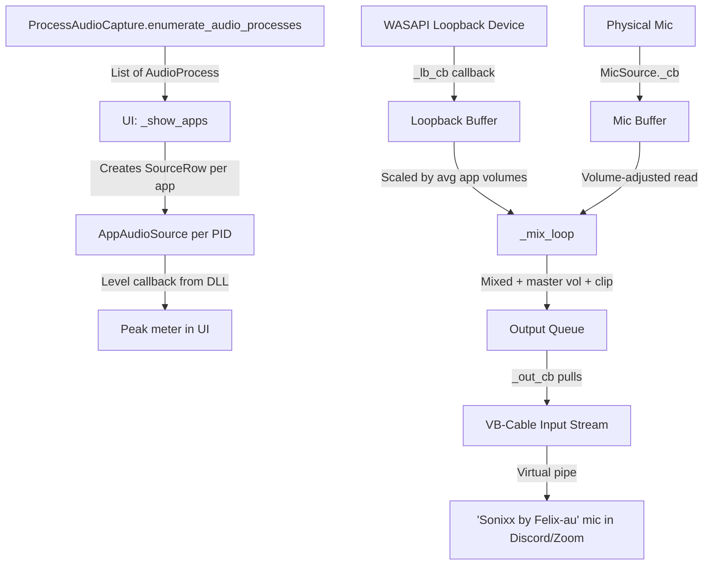

# Sonixx by Felix-au — Virtual Audio Router: Architecture Study

## 1. What Is Sonixx by Felix-au?

**Sonixx by Felix-au** is a **Windows desktop application** (Python + CustomTkinter) that lets you pick any application producing audio (Chrome, Spotify, games, etc.) and route that audio into a **virtual microphone device** — so other apps like Discord, Zoom, or OBS receive it as mic input.

```
┌──────────────┐   ┌──────────────┐   ┌────────────┐
│ Chrome audio │   │ Spotify audio│   │ Your mic   │
└──────┬───────┘   └──────┬───────┘   └─────┬──────┘
       │                  │                  │
       ▼                  ▼                  ▼
 ┌─────────────────────────────────────────────────┐
 │           Sonixx by Felix-au Audio Router (Python)          │
 │                                                 │
 │  WASAPI Loopback ──→ Mix + Volume ──→ Output    │
 │  Per-App Monitor  ──→ Peak Levels               │
 │  Mic Capture      ──→ Mix                       │
 └────────────────────────┬────────────────────────┘
                          │
                          ▼
              ┌───────────────────────┐
              │ VB-Cable Input        │
              │ (Virtual Audio Pipe)  │
              └───────────┬───────────┘
                          │
                          ▼
              ┌───────────────────────┐
              │ "Sonixx by Felix-au" Virtual Mic  │
              │ (CABLE Output renamed)│
              └───────────────────────┘
                          │
                          ▼
              Discord / Zoom / OBS picks
              "Sonixx by Felix-au" as microphone input
```

---

## 2. Why VB-Cable Is Required

> [!IMPORTANT]
> Windows **only** allows kernel-mode audio drivers to register as microphone devices. No userspace application (Python, C#, Java, Electron) can create a mic device without a driver. VB-Cable (free, 2MB) is that driver — it creates a virtual audio pipe that appears as both an output device ("CABLE Input") and an input device ("CABLE Output"). Sonixx by Felix-au writes audio to the output side, and apps read from the input side.

---

## 3. Project Structure

```
soundboard/
├── main.py              # Entry point — launches App, hooks WM_DELETE_WINDOW
├── requirements.txt     # 8 dependencies
├── run.bat              # One-click setup: pip install + launch
└── app/
    ├── __init__.py      # Package marker
    ├── driver.py        # VB-Cable detection, download, install, registry rename
    ├── audio_router.py  # Core mixing engine — capture + mix + output
    └── ui.py            # CustomTkinter UI — setup wizard + main interface
```

---

## 4. Module-by-Module Breakdown

### 4.1 `driver.py` — VB-Cable & Device Setup
[driver.py](file:///c:/Users/Felix/Desktop/soundboard/app/driver.py)

| Function | Purpose |
|---|---|
| [find_wasapi(pa)](file:///c:/Users/Felix/Desktop/soundboard/app/driver.py#L9-L13) | Finds the WASAPI host API index from PyAudio |
| [is_cable_installed(pa)](file:///c:/Users/Felix/Desktop/soundboard/app/driver.py#L16-L23) | Checks if any VB-Cable device exists (searches for "cable" in device names) |
| [get_cable_output_device(pa)](file:///c:/Users/Felix/Desktop/soundboard/app/driver.py#L26-L43) | Finds the "CABLE Input" device where audio is **written to** (output side of the pipe) |
| [download_vbcable(dest_dir)](file:///c:/Users/Felix/Desktop/soundboard/app/driver.py#L46-L55) | Downloads the VB-Cable ZIP from vb-audio.com |
| [extract_and_install(zip_path)](file:///c:/Users/Felix/Desktop/soundboard/app/driver.py#L58-L79) | Extracts ZIP, finds the 64-bit installer, and launches it |
| [rename_to_Sonixx by Felix-au()](file:///c:/Users/Felix/Desktop/soundboard/app/driver.py#L82-L114) | Renames "CABLE Output" to "Sonixx by Felix-au" in Windows registry (requires admin) |

### 4.2 `audio_router.py` — Core Audio Engine
[audio_router.py](file:///c:/Users/Felix/Desktop/soundboard/app/audio_router.py)

Three main classes:

#### `AppAudioSource` (Line 11–58)
Represents a single application producing audio. Uses `process-audio-capture` for per-app **level monitoring** (not capture — actual capture is done via loopback).

| Field | Type | Purpose |
|---|---|---|
| `proc` | `AudioProcess` | The process object from `process-audio-capture` |
| `pid` / `name` | int / str | Process identification |
| `volume` | float | 0.0–2.0 volume multiplier |
| `active` / `muted` | bool | Toggle and mute state |
| `peak_db` | float | Current dB level from DLL callback |
| `_capture` | `ProcessAudioCapture` | DLL handle for per-process level monitoring |

#### `MicSource` (Line 61–111)
Represents a physical microphone input via WASAPI.

| Method | Purpose |
|---|---|
| `start()` | Opens a WASAPI input stream with a callback |
| `_cb()` | Stream callback — stores raw audio buffer + computes peak |
| `read()` | Returns volume-adjusted buffer (or `None` if muted/inactive) |
| `get_peak()` | Returns linear peak level for the UI meter |

#### `AudioRouter` (Line 114–322)
The central mixing engine. Manages all sources and produces mixed output.

| Method | Purpose |
|---|---|
| `add_mic() / remove_mic()` | Manage mic sources |
| `add_app() / remove_app()` | Manage app sources (monitoring only) |
| `set_app_volume/active/muted()` | Per-app controls |
| `start(loopback_dev, output_dev)` | Opens loopback capture + output stream + starts mix thread |
| `_lb_cb()` | Loopback stream callback — stores system audio buffer |
| `_mix_loop()` | Main mix thread — combines loopback (scaled by app volumes) + mic buffers |
| `_out_cb()` | Output stream callback — pulls mixed data from queue |
| `stop() / cleanup()` | Teardown |

**Key mixing logic** ([_mix_loop](file:///c:/Users/Felix/Desktop/soundboard/app/audio_router.py#L230-L280)):
```python
# 1. Take loopback buffer (system audio from default output)
# 2. Scale by average volume of active app sources
# 3. Add each mic source buffer
# 4. Apply master volume + mute
# 5. Clip to [-1.0, 1.0]
# 6. Push to output queue → VB-Cable
```

### 4.3 `ui.py` — User Interface
[ui.py](file:///c:/Users/Felix/Desktop/soundboard/app/ui.py)

#### Color Palette (Line 10–13)
```python
P = {"bg":"#080810", "card":"#101018", "accent":"#7c6cf0", "green":"#00d9a3", ...}
```
Dark theme with purple accent, green/red status indicators.

#### `SourceRow` Widget (Line 24–55)
A reusable row for both app and mic sources:
- Toggle switch (on/off)
- Icon + label
- Volume slider (0–200%)
- Peak level meter (Canvas-based, green→orange→red)
- Remove (✕) button

#### `App` Main Window (Line 57–321)

**Two modes:**

1. **Setup Wizard** (`_build_setup`) — Shown if VB-Cable not detected. Offers download, manual install link, and refresh.

2. **Main Interface** (`_build_main`) — Split layout:
   - **Left panel**: Applications list (scan button + rows) + Microphones (dropdown + add button + rows)
   - **Right panel**: Output target info, loopback device selector, master volume slider, peak meter, start/stop/mute buttons
   - **Footer**: Status bar

**Key UI flows:**
- `_scan_apps()` → calls `ProcessAudioCapture.enumerate_audio_processes()` in a background thread → `_show_apps()` creates `SourceRow` per process
- `_add_mic()` → gets device from combo box → adds to router → creates `SourceRow`
- `_start()` → validates cable + loopback → `router.start()` → begins 50ms peak update loop
- `_update_peaks()` → polls each source's level → redraws Canvas meters

---

## 5. Data Flow Summary



---

## 6. Current Limitations & Issues

### 🔴 Critical

| Issue | Details |
|---|---|
| **No true per-app capture** | Loopback captures ALL audio from the default output device, not just selected apps. Per-app volumes scale the entire loopback buffer by the average of active app volumes — this means toggling Chrome off doesn't silence Chrome; it reduces the total volume. |
| **App volume averaging is misleading** | Setting Chrome to 50% and Spotify to 150% averages to 100% — applied to all audio, not individually. |

### 🟡 Moderate

| Issue | Details |
|---|---|
| **No sample rate resampling** | Mic and loopback may have different sample rates — buffer length mismatch causes audio artifacts |
| **Channel mismatch** | Mono mic mixed into stereo loopback without proper channel mapping |
| **Queue overflow handling** | When the queue is full, the oldest frame is dropped — can cause audible pops |
| **Hardcoded 48kHz in mix_loop** | `interval = CHUNK / 48000 * 0.7` — doesn't adapt to actual device sample rate |
| **No error recovery** | If a mic disconnects or an app closes, no automatic cleanup |
| **Registry rename requires admin** | No UAC elevation prompt — just silently fails |

### 🟢 Minor/Polish

| Issue | Details |
|---|---|
| **No settings persistence** | Volume levels, mic selection, window position reset on restart |
| **No system tray** | Can't minimize to tray |
| **No hotkeys** | No global hotkey for mute/unmute |
| **Friendly name map is limited** | Only 13 apps mapped; others get basic `.exe` → title conversion |

---

## 7. Improvement Roadmap

### Priority 1: True Per-App Audio Isolation
The `process-audio-capture` library already wraps the Windows `AUDIOCLIENT_PROCESS_LOOPBACK_PARAMS` API which supports **per-process loopback**. The current code only uses it for level monitoring. The fix is to:
1. Use `ProcessAudioCapture` to capture each app's audio to a temp WAV or pipe
2. Read those buffers in the mix loop instead of using a single system-wide loopback
3. This gives real per-app volume control

### Priority 2: Audio Quality
- Implement proper resampling (use `scipy.signal.resample` or `numpy` interpolation)
- Handle channel count mismatches properly (mono→stereo, stereo→mono)
- Use the device's actual sample rate instead of hardcoded 48kHz

### Priority 3: UX Enhancements
- Settings persistence (JSON config file)
- System tray with minimize-to-tray
- Global hotkeys (pynput or pystray)
- Auto-scan (periodically re-enumerate audio processes)
- App icons (extract from .exe using `win32gui`)

### Priority 4: Stability
- Device disconnect detection and recovery
- Proper UAC elevation for registry rename
- Graceful handling of apps that start/stop producing audio

---

## 8. Dependency Map

| Package | Version | Purpose |
|---|---|---|
| `customtkinter` | ≥5.2.0 | Modern themed Tkinter UI |
| `PyAudioWPatch` | ≥0.2.12 | WASAPI support (loopback devices) |
| `numpy` | ≥1.24.0 | Audio buffer math (mixing, clipping, peak) |
| `pycaw` | ≥20230407 | Windows Core Audio API (sessions) |
| `psutil` | ≥5.9.0 | Process info (currently unused in final code) |
| `comtypes` | ≥1.2.0 | COM interface for Windows APIs |
| `Pillow` | ≥10.0.0 | Image handling (currently unused) |
| `process-audio-capture` | ≥1.0.0 | Per-process audio enumeration + level monitoring via Windows DLL |

> [!NOTE]
> `psutil` and `Pillow` are listed as dependencies but are not currently imported or used in the active codebase. They were likely carried over from earlier iterations and can be safely removed if unused features aren't planned.
